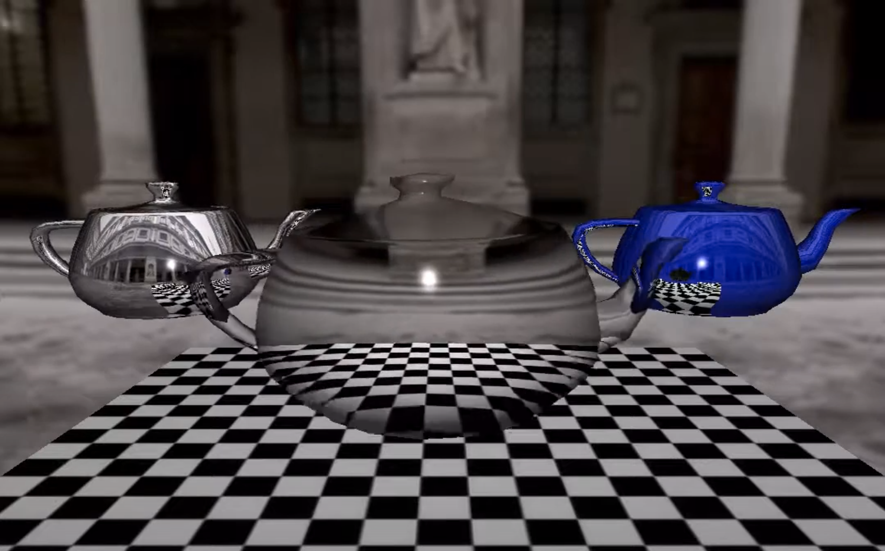

# A-renderer-from-scratch
This is a c++ renderer from scratch. The codes start from the CS535 course, but extend with many features. There are some paper implementations as well. 

Current features: 

* Basic Vector, matrices and transformations.
* Rasterization, Raytracing, screen-space and model space interpolation. 
* Multiple lightings and shadow maps. 
* Texture mapping, Projective texture, Bilinear texture filter, Trilinear Lod texture, Environment mapping.
* Implemented the paper: “Popescu, V., Mei, C., Dauble, J., & Sacks, E. (2006, September). Reflectedscene impostors for realistic reflections at interactive rates. In Computer Graphics Forum (Vol. 25, No. 3, pp. 313-322). Oxford, UK and Boston, USA: Blackwell Publishing, Inc.” 

## Sample Result
The implementation of the paper: (A billboard method for rendering reflections in rasterization pipeline)

https://www.youtube.com/watch?v=QnilNUElEjM
